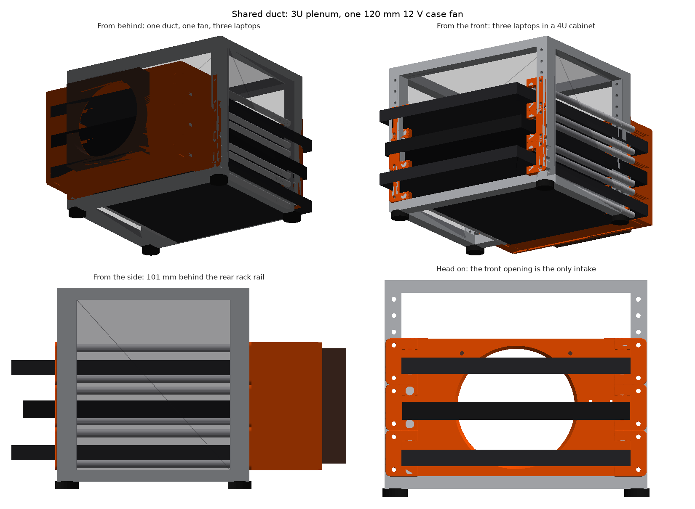
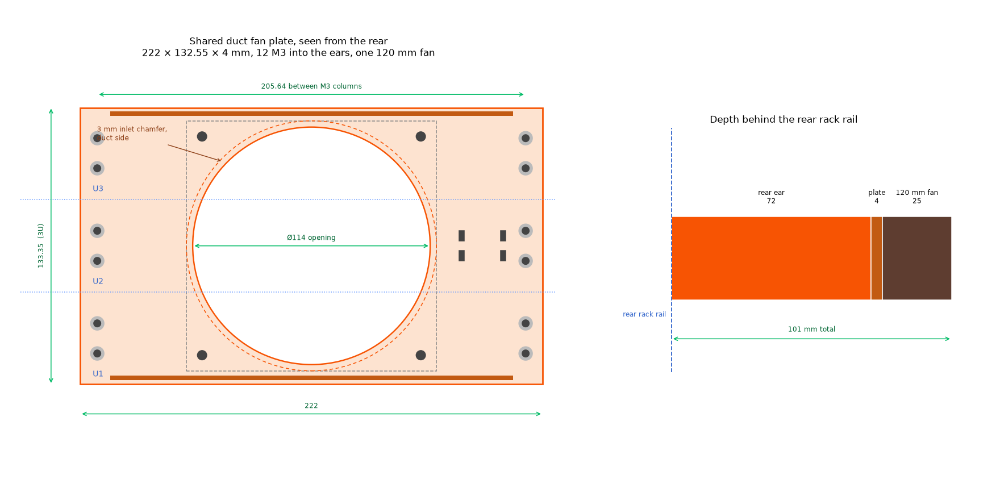
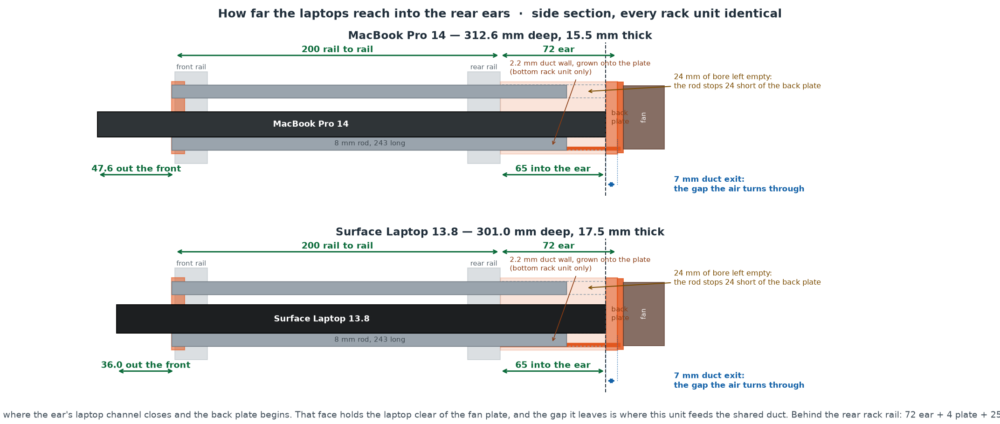
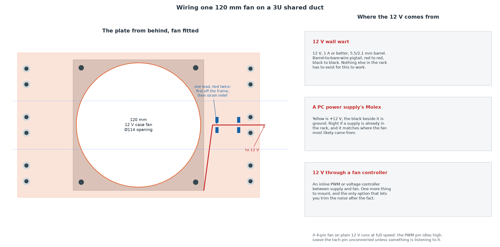

# Mini-Rack Shared Duct

Three laptops in a 10-inch mini rack, cooled by **one shared duct and one 120 mm PC case fan** instead of a fan plate per tray.

A fork of [mini-rack-laptop-trays](https://github.com/mhuot/mini-rack-laptop-trays), which builds the same rack one tray at a time: each laptop gets its own 1U duct, its own plate and its own three 40 mm fans. Stack three of those and you have nine fans, nine leads and three ducts that cannot help each other. This project keeps the ears, the rods and the sliding-drawer idea exactly as they are, and replaces everything behind them with a single plenum.



**[Open the interactive 3D viewer](https://mhuot.github.io/mini-rack-shared-duct/)** — drag to orbit, scroll to zoom. Printed parts are shown in orange; print in whatever colour you like.

## What makes it cheap

The rear ears already did the hard part, which is why this fork is mostly deletion.

Each ear fills its rack unit exactly — 0 to 44.45 mm, no gap at either end. Stack three pairs and their outboard side walls become **one continuous 133.35 mm wall**. The duct's sides are sealed by the ears alone, with no new part and no change to a part that already prints and fits.

That leaves only the top and the bottom to close, so the plate grows **two** duct walls instead of six. The four duct rails at the rack-unit boundaries in between are left empty on purpose: each is closed at its outboard end by the ear body, which makes it a dead-end groove rather than a leak path. Filling them would divide the plenum, which is the one thing this fork exists to avoid.



## How it works

- **Front and rear ears, rods and laptop mounting are unchanged from upstream.** Mirrored pairs bolt to the rack rails, each carrying two 8 mm smooth-rod positions 24 mm apart; the laptop slides between the rod pairs and rests on the lower rods. Rods are 243 mm. Nothing in this fork touches any of it.
- **The rear ears still extend 72 mm out the back**, and the laptop's rear edge still stops against their back plates 65 mm in, leaving the same 7 mm duct exit. Each rack unit feeds that 7 mm gap into the shared plenum instead of into its own fans.
- **One plate spans the whole stack** — 222 × 132.55 × 4 mm — bolted at **twelve** M3 screws into the heat-set inserts the ears already have, six per side. It carries two 2.2 mm duct walls, 193.44 mm wide, grown onto its front face, that slide into the duct rails of the bottom ear and the top ear with 0.60 mm of clearance a side.
- **One 120 mm 12 V case fan** sits in the middle of it, over a Ø114 opening. Frame, 105 mm screw pitch and Ø4.5 corner holes are the sizes every vendor already builds to, so a fan pulled out of an old PC drops straight in.
- The cabinet's closed acrylic sides and top still make the front opening the only intake, so flow is front-to-back through every slot.



### Why one fan, and what it costs

Upstream's argument was that three Ø39 openings (3584 mm²) roughly matched one duct's free area (about 3880 mm²), so the openings stopped being the restriction. Running the same argument here gives a different answer, and it is worth stating plainly rather than burying.

`scripts/check_rear_assembly.py` measures the plenum off the actual meshes, with three laptops in it:

```
plenum free area              :    13645 mm2
fan opening O114              :    10207 mm2
opening as a share of the duct:     74.8%
the opening is the restriction, not the duct
```

So **the opening is the bottleneck here**, where upstream's was not — which is why the [inlet chamfer](#the-inlet-chamfer) is worth having. One 120 mm fan is quieter and needs one lead and one supply, but it is not more nominal airflow than nine NF-A4x20s, and this design does not pretend otherwise. [Static pressure](#static-pressure) is the next section because it is the usual counter-argument, and it does not hold either.

Upstream's other metric — "no point of the duct is more than 31.8 mm from a fan" — does not survive the change and should not be quoted here. It governed a 44 mm duct whose exhaust plane was the fan plate itself, where lateral distance really did set the dead corners. A 194 × 133 plenum equalises static pressure across its own cross-section instead, so what matters is each rack unit's exit area, not how far a corner sits from the fan.

### Static pressure

A fan's advertised airflow is its **free-air** figure — what it moves against no resistance at all. What it actually delivers is wherever its pressure-flow curve crosses the system's resistance curve, so the number that matters is how much static pressure this duct actually asks for. `python scripts/duct_pressure.py` works that out from the areas the assembly check measured:

| Flow | Plenum | Opening | Sharp lip | 3 mm chamfer | Saved |
|---|---|---|---|---|---|
| 15 CFM | 0.52 m/s | 0.69 m/s | 0.51 Pa | 0.43 Pa | 17% |
| 30 CFM | 1.04 m/s | 1.39 m/s | 2.05 Pa | 1.71 Pa | 17% |
| 45 CFM | 1.56 m/s | 2.08 m/s | 4.62 Pa | 3.84 Pa | 17% |
| 60 CFM | 2.07 m/s | 2.77 m/s | 8.22 Pa | 6.83 Pa | 17% |

**This is a low-resistance system.** At 45 CFM it asks for 3.84 Pa, or 0.39 mm H₂O, against the 1.0–2.5 mm H₂O a typical 120 mm case fan can produce at peak. The fan runs near the free-delivery end of its curve, which is the regime where a big slow fan does well. There is no dense heatsink here, no filter, no long run of duct — just a short plenum and one large hole.

### So why one big fan?

Not for pressure. It follows from the table that the duct is not pressure-limited under any plausible option, so pressure cannot decide between them. Comparing the two ways to fill it:

| | Swept area | Tip speed | Relative pressure |
|---|---|---|---|
| One 120 mm at 1200 rpm | 11,310 mm² | 7.54 m/s | 1.00× |
| Nine 40 mm at 5000 rpm | 10,751 mm² | 10.21 m/s | **1.83×** |

Swept area is a near tie. Peak static pressure scales roughly with tip speed squared, and the small fans have the *higher* tip speed — 4.2× the rpm is 1.35× the tip speed — so nine 40 mm fans have **more** pressure headroom and more peak flow than one 120 mm fan, not less. If you want maximum airflow into this duct, the array wins.

**The case for one big fan is noise and simplicity.** Two rules of thumb, both estimates rather than measurements: broadband fan noise rises with roughly the fifth power of tip speed, worth about +6.6 dB for the array, and nine uncorrelated sources sum to +9.5 dB over one. On the order of **16 dB louder** for the same job — plus nine leads, nine splices and nine things to fail. On a desk, next to the person using the laptops, that is the trade worth making.

Everything in this section is a first-order estimate with textbook loss coefficients, not CFD and not a measurement. It is enough to answer the question it was built for — is this a duct where a big slow fan wins — and not enough to predict a temperature.

### The inlet chamfer

The fan opening is chamfered **3 mm at 45° on the duct side**. A sharp lip in a 4 mm plate makes the flow separate as it turns in, so the throat that actually passes air is smaller than the hole that was cut — and since the measurement above says the opening is the restriction, easing it is the cheapest thing in this design that helps.

It costs nothing anywhere else. The chamfer dies out 1 mm short of the rear face, so the land the fan frame seals against is untouched at its full 3 mm width. And the plate prints rear-face-down, which puts the chamfer on the **up**-facing side: the hole widens as it rises, so every layer sits fully on the one below and none of it is an overhang.

What was considered and rejected: a **pocket** for the fan frame to drop into (it would eat the 3 mm sealing land on a 4 mm plate, to locate a fan the corner screws already locate), and a **collar** projecting into the plenum (the plenum is 72 mm deep and the fan's mid-height sits right where the middle laptop's exit gap feeds it — a collar would block the flow it was meant to guide).

## Verification

Everything below is measured, not asserted. `python scripts/check_rear_assembly.py` stacks six ears, fits the plate and reports:

```
=== interference (exact boolean, any volume > 0 is a clash) ===
  0 clash(es)

=== is the shared duct sealed? ===
  as built, 0.60 mm slide clearance      z= 36.0  plenum   34689.7 mm2  open
  walls run out to the groove floor      z= 36.0  plenum   26294.0 mm2  sealed

=== the slide clearance, as a hole ===
  leak area, 4 wall ends        :     5.28 mm2
  as a share of the fan opening :    0.052%
```

The duct "leaks", and it is supposed to: each duct wall stops 0.60 mm short of the ear's groove floor so the plate can be assembled at all. That clearance is deliberately generous — the wall is a 193 mm span on a 250 mm bed, where thermal contraction and a squashed first layer each cost more than a tenth of a millimetre, and 0.60 mm still leaves 11.4 mm of engagement in a 12 mm slot. A cross-section cannot tell that gap from a missing face, so the test runs twice — once as built, once against a plate whose walls run all the way to the groove floor. The second one seals, which is the claim worth making: **there is no hole in this duct beyond the clearance it needs to go together**, and that clearance is 5.28 mm², or 0.052% of the fan opening.

### The one failure this fork can have that upstream could not

Six ears stacked three high only seal if they actually touch:

```
  0.0 mm between stacked ears   still sealed
  0.2 mm between stacked ears   OPEN to ambient
  0.5 mm between stacked ears   OPEN to ambient
```

The model butts them at exactly 44.45 mm. A real rack's rail holes are not perfect, and 0.2 mm of accumulated error opens the duct to ambient along the seam. It is not a catastrophe — it is a slot, not a hole, and the fan will still pull through the plenum — but if it whistles, a strip of foam tape down each seam is the fix. Check the seams before you blame the fan.

### Checking the renders

A render is the easiest thing in this repo to get wrong, because a wrong one
still looks like something. Two got published before anyone noticed: the rods
were rotated onto the vertical axis, so every image showed four short posts per
rack unit instead of four 243 mm rods running front to back; and the camera
azimuths were inverted, so the view captioned "from the front" was looking at
the back of the rack.

Neither would have failed a test that only asked whether the script finished.
So `python scripts/check_render.py` asserts the things the renders claim:

- **no part passes through another part.** Laptops against rails, printed
  parts against rails, rods against rails, anything against the acrylic. A
  tolerance of 25 mm³ absorbs coincident-surface films (a laptop resting
  exactly on the plane the ear's relief is cut to) so the check does not cry
  wolf; anything above that is a collision
- every laptop clears the opening it has to slide through, reported as a
  clearance so a failure says by how much
- every part is present, once, and has positive volume — a silently dropped
  part shows up as a count
- rods are 243 mm **along z**, Ø8, on the rod lines. This is the check that
  catches a rotated axis
- laptops nose out the front by 47.6 mm and 36.0 mm, stop at the ear's back
  plate, and fit inside the cabinet
- the cabinet is 4U and the feet hang below the frame, on the right axis
- the plate's rear face and the fan's back are where the depth diagram says,
  so the 101 mm in this README stays true
- **each view's caption matches where the camera actually points.** A view that
  says "from the front" must have a view direction with positive z

The caption rule is the interesting one. A caption is a claim, and this is the
only thing in the repo that checks a claim made in words against geometry.

### Why the renderer is a z-buffer

It started as a painter's algorithm: project every triangle, sort by centroid
depth, paint far to near. That is a heuristic, and it fails on exactly the
geometry this rack is made of. Two triangles that interpenetrate have no
correct order at all; nor does a large one crossing a small one. The acrylic
panels seamed against the frame and the plate speckled where the fan met it.

It is now a per-pixel depth test. Barycentric coordinates are evaluated over
each triangle's pixel bounding box with three edge functions, depth
interpolates across them — linearly, which is exact under an orthographic
projection — and a pixel is written only where it is nearer than what is
already there. There is no ordering left to get wrong. Rendering is
supersampled 2× and box-filtered down, and the whole thing takes about a
second per view.

Transparency is the one thing a depth buffer cannot do alone, so the opaque
geometry goes down first and the clear faces composite over it afterwards,
far to near, testing depth without writing it.

`check_render.py` tests the rasteriser directly against the three cases the
sort got wrong: a far triangle drawn after a near one, two triangles that
interpenetrate, and a clear triangle over an opaque one. Breaking the depth
test makes those fail.

### What the interference check found immediately

The cabinet's clear opening was modelled at **221.0 mm** between rails, and a
MacBook Pro 14 is **221.2 mm** wide. The laptop has to slide through that gap
to get into the rack, so the model was quietly asserting that the reference
laptop does not fit through the front of its own rack — by 0.2 mm, in every
render this project and its upstream have ever published.

The model now uses 222.0 mm, which is the **minimum the design requires**, not
a dimension measured off a real cabinet. That distinction matters: if you are
building this, measure the clear opening between your rack's rails and check it
against the laptop you intend to put in. The ears' own laptop relief is cut to
221.9 mm, so that is the widest this design accommodates regardless of what
your cabinet does.

Both original bugs were re-introduced deliberately to confirm the check fails
on them, which caught a third bug — in the checker itself. Two of its three
view rules matched with `startswith("behind")` against a caption reading
"From behind: ...", so they never fired and the suite looked green regardless.
A check that cannot fail is worse than no check, because it is also a claim.

## Compatibility

Designed around a rack with 236.525 mm rail-hole span and 200 mm rail-to-rail depth ([GeeekPi 4U 10-inch cabinet / DeskPi RackMate T0](https://www.amazon.com/dp/B0DPGZPTPP); see the [mini-rack project](https://mini-rack.jeffgeerling.com/) for the ecosystem). The duct is 3U, so a 4U cabinet leaves one unit spare.

| Laptop | Dimensions (mm) | Fit |
|---|---|---|
| MacBook Pro 14 (M-series) | 312.6 × 221.2 × 15.5 | ✅ designed for |
| Surface Laptop 7th Ed. 13.8" (Intel) | 301 × 220 × 17.5 | ✅ same parts, unchanged |

Anything ≤ 222 mm deep and ≤ ~20 mm thick that can hang its side edges on rods 205.6 mm apart should work. Mixing models up the stack is fine — the plenum does not care what shape each unit's exit gap is.

**Two laptops instead of three?** Set `RACK_UNITS = 2` and `FAN_SIZE = 80` in `scripts/shared_duct_params.py` and rebuild. A 2U duct is 88.9 mm tall, which fits an 80 mm fan and not a 120. `check_fits()` refuses the combination rather than letting you print a plate the fan cannot mount to.

## Bill of materials

Note the split: **ears are per laptop, everything else is once for the whole rack.**

**Printed parts** (PETG recommended — they live next to a warm laptop):

| Part | Qty | Notes |
|---|---|---|
| Front Ear (`exports/front_ear.stl`) | 2 per laptop | mirror one in the slicer |
| Rear Ear v2 (`exports/rear_ear_v2.stl`) | 2 per laptop | mirror one; bosses take M3 heat-set inserts |
| Shared duct fan plate (`exports/shared_fan_plate.stl`) | 1 | 172 g, the long print of the build |
| Fan guard (`exports/fan_guard.stl`) | 0–1 | optional, 25 g — see [Fan guard](#fan-guard) |

**Hardware:**

| Item | Qty | Notes |
|---|---|---|
| 8 mm smooth rod, 243 mm | 4 per laptop | deburr and chamfer the ends |
| 120 mm 12 V case fan | 1 | any make; 105 mm pitch is universal |
| M3 × 3 mm heat-set inserts (short) | 4 per laptop | Ø4.0 × 3.2 pockets (skip for the self-tap ear variant) |
| M3 × 8 socket-head screws | 4 per laptop | 12 total on a three-laptop rack |
| M3 hex nuts | 4 per laptop | nut-trap ear variant only |
| M4 × 30 screws + nuts, or the fan's own self-tappers | 4 | through the 4 mm plate into the fan frame |
| Rack screws | 8 per laptop | per your rack's rail standard |
| 12 V supply | 1 | see [Wiring](#wiring) |

### Ear variants

Unchanged from upstream, and all three take the same plate and the same M3 × 8 screws:

- **Heat-set** (`exports/rear_ear_v2.stl`) — the most compact and the nicest to work on.
- **Nut-trap** (`exports/rear_ear_v2_nuttrap.stl`) — side-loading slots capture standard M3 hex nuts (a DIN 562 square nut fits the same slot). Metal threads, unlimited assembly cycles. The plate sits 2 mm further back.
- **Self-tap** (`exports/rear_ear_v2_selftap.stl`) — Ø2.5 pilot holes the M3 screws thread directly into. Simplest, good for about a dozen cycles.

A note on all three: the ear prints standing on its rail flange, so the back plate starts as a bridge across the open duct and the insert pocket sits directly above it. The heat-set pocket is 3.2 mm deep on a 3.8 mm floor; the self-tap and nut-trap variants keep 1.5 mm on a thinner plate.

## Print plates

Three plates, arranged for a 250 × 220 bed. Regenerate with `scripts/build_print_plate.py`.

- `exports/print_plate_ears_heatset.3mf` (also `_selftap` / `_nuttrap`) — one laptop's ears. **Print this three times.**
- `exports/print_plate_shared_fan_plate.3mf` — the whole duct in one part. Print once.
- `exports/print_plate_fan_guard.3mf` — optional, on its own plate because it is optional.

The plate is 222 mm across and **will not fit a Prusa Mini**, so the generator refuses `--bed mini` for it by name rather than failing somewhere inside the packer. The ears and the guard both fit a Mini (`--bed mini`), so they can run on a second printer while the plate is going.

Print the plate **plate-down**, so the first layer is the full solid rectangle and the two duct walls rise 72 mm behind it as 2.2 mm fins. That is the cost of integrating them, and it is why this is one long print instead of three short ones.

### Fan guard

A 120 mm fan spinning in the open back of a rack is the one part of this build that can bite, and the fix is a flat printed grille on the same four screws that hold the fan (use screws one length longer). It leaves **77% of the throat open** — 7828 mm² of 10207 — which is where a stamped steel guard lands too. Radial bars, so they lie along the flow rather than across it. Prints flat, no support, well under an hour.

## Wiring

One fan, one lead. A 120 mm case fan draws well under an amp; the only thing worth getting right is where the 12 V comes from, and there are three reasonable answers.



- **A 12 V wall wart** — 1 A or better, with a barrel-to-bare-wire pigtail. Red to red, black to black. Nothing else in the rack has to exist for this to work.
- **A PC power supply's Molex** — yellow is +12 V, the black beside it is ground. Right if a supply is already in the rack, and it matches where the fan probably came from.
- **An inline fan controller** — PWM or voltage, between supply and fan. One more thing to mount, and the only option that lets you trim the noise after the fact.

Whichever you use: a 4-pin fan on plain 12 V runs at **full speed**, because the PWM pin idles high. Leave the tach pin unconnected unless something is listening to it. Route the lead along the plate through the two tie-slot pairs — the first catches it off the fan frame, the second is strain relief where it leaves — with a service loop generous enough that the plate can be unscrewed without unplugging anything.

Upstream's warning is worth repeating in reverse: it ran 5 V Noctuas and had to avoid boost cables. This runs 12 V, so **do not** feed it from a USB port expecting it to spin properly.

## Assembly

1. Print the parts; heat-set four inserts into each pair of rear ears.
2. Mount front ears to the front rails and rear ears to the rear rails, three pairs of each, in adjacent rack units. **Check the seams between stacked ears close up** before going further.
3. Slide four rods per unit through the front ears into the rear ears' sockets.
4. Screw the fan to the rear face of the plate, label facing back — it exhausts rearward. Add the guard on the same screws if you printed one.
5. Offer the plate up, duct walls first, sliding them into the bottom and top ears' duct rails. Drive the twelve M3 screws through the counterbored holes into the ear inserts.
6. Wire the fan, confirm it spins, and slide the laptops in, lids closed, cables at the front.

Total stack behind the rear rack rail is **101 mm** (ears 72 + plate 4 + fan 25) — leave that much clearance behind the rack. That is 5 mm more than upstream, all of it the difference between a 25 mm case fan and a 20 mm Noctua.

## CAD and scripts

The ears come out of Fusion 360 and have to: they are full of tangency and relief work that only survives as parametric history. The plate does not — it is a rectangle, two fins and eleven holes — so this fork builds it **both** ways, and both read their numbers from the same module.

**Runs anywhere** (`pip install -r requirements.txt`):

- [`shared_duct_params.py`](scripts/shared_duct_params.py) — every number the duct is built from, in one place, standard library only. `check_fits()` refuses a fan that will not fit the duct.
- [`build_shared_fan_plate_mesh.py`](scripts/build_shared_fan_plate_mesh.py) — the plate, from primitives, straight to a printable STL. **No Fusion licence needed.** `--compare <stl>` checks a Fusion export against it and reports what differs, by location and volume — run it after every Fusion rebuild, because a save that is missing a feature looks perfectly fine.
- [`build_fan_guard_mesh.py`](scripts/build_fan_guard_mesh.py) — the optional guard.
- [`check_rear_assembly.py`](scripts/check_rear_assembly.py) — interference, seal, ear-seam and free-area checks.
- [`build_print_plate.py`](scripts/build_print_plate.py) — the 3MF print plates.
- [`render_shared_duct.py`](scripts/render_shared_duct.py) — the renders and the GLB on this page, drawn from the same meshes the checks run against. A z-buffer rasteriser in about a hundred lines; no GL context, no display, nothing beyond numpy.
- [`check_render.py`](scripts/check_render.py) — asserts that the rack in the renders is the rack in the design, and that the rasteriser resolves depth. See [Checking the renders](#checking-the-renders).
- [`build_depth_diagram.py`](scripts/build_depth_diagram.py), [`build_wiring_diagram.py`](scripts/build_wiring_diagram.py) — the two diagrams.
- [`duct_pressure.py`](scripts/duct_pressure.py) — the static-pressure estimate above, from the measured areas. Standard library only.
- [`check_terminology.py`](scripts/check_terminology.py) — every part has one name; this fails if a retired one creeps back in.

**Fusion 360 only** (they `import adsk` and need the documents open):

- [`build_shared_fan_plate.py`](scripts/build_shared_fan_plate.py) — the same plate, parametric, with the inlet chamfer as a real chamfer feature.
- [`build_rear_ear_v2.py`](scripts/build_rear_ear_v2.py), [`add_duct_rails.py`](scripts/add_duct_rails.py), [`fix_insert_pockets.py`](scripts/fix_insert_pockets.py), [`export_front_ear.py`](scripts/export_front_ear.py) — the ears, unchanged from upstream.
- [`build_rack_mockup.py`](scripts/build_rack_mockup.py) — the full-rack mockup.

Fusion API note: all API lengths are centimeters; the scripts define `MM = 0.1` and work in millimeters throughout.

Every printable part also ships as standalone CAD in [`cad/`](cad/) — a STEP and a Fusion archive per part, the plate included. Fusion's BRep and the local mesh agree to 0.013% (135,366.2 mm³ against 135,383.7), and a component-level diff of Fusion's STL against the model is clean at every export refinement.

### Renders

The images on this page are generated locally from the exported meshes, not from a Fusion session. Upstream's photorealistic Fusion renders were removed rather than kept, because every one of them showed three 40 mm fans per tray — a different product. Anyone with Fusion who reruns `build_rack_mockup.py` can produce better-looking replacements; until then, what is here is at least accurate.

## License

[MIT](LICENSE) — scripts, models, and STLs alike, same as upstream. Attribution appreciated but not required.
