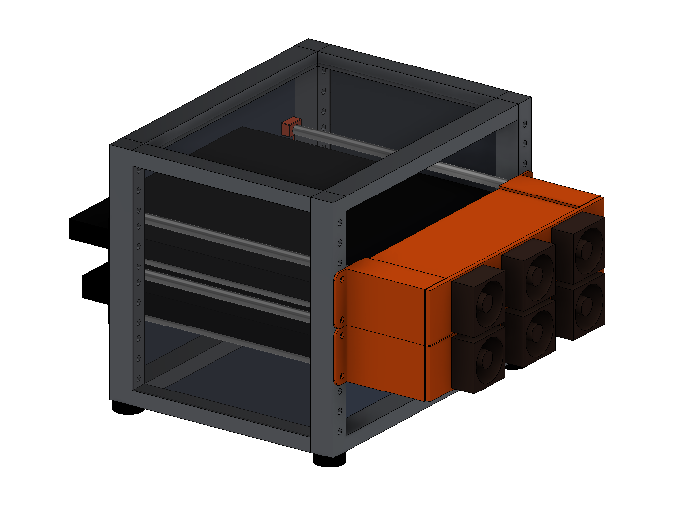
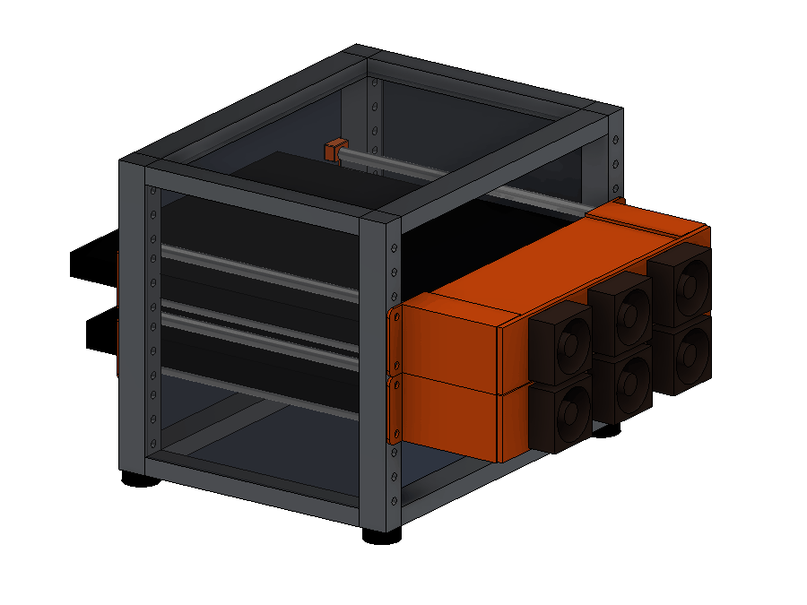
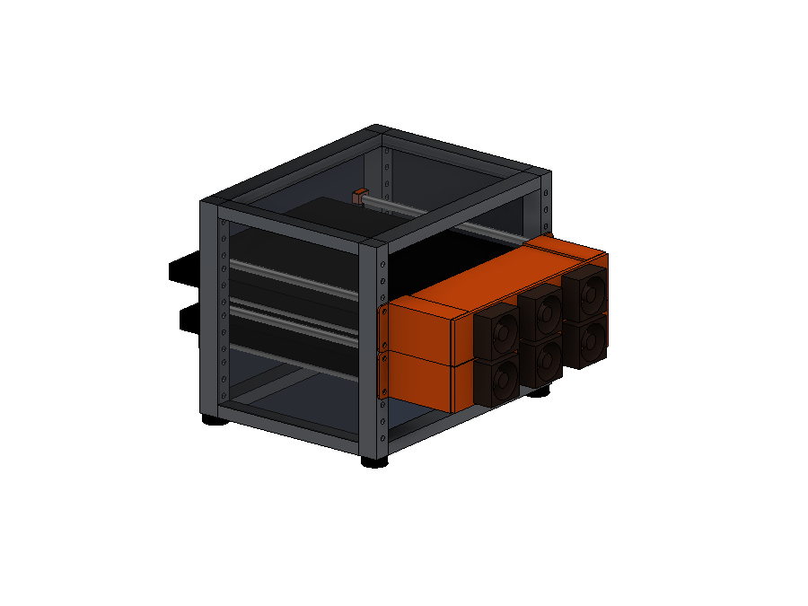
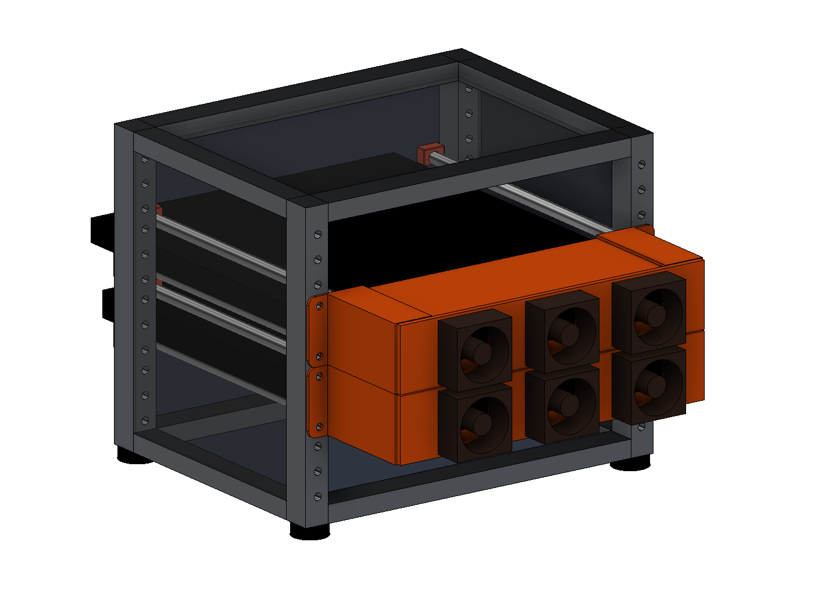
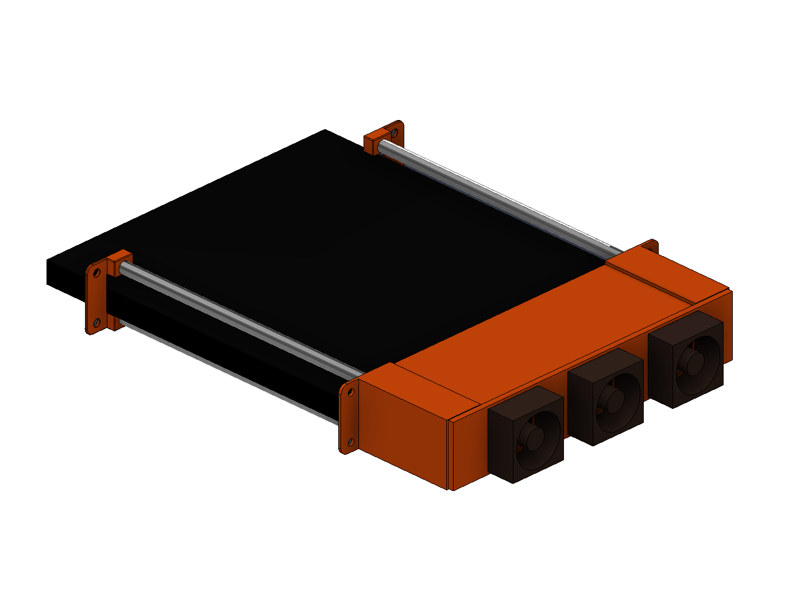
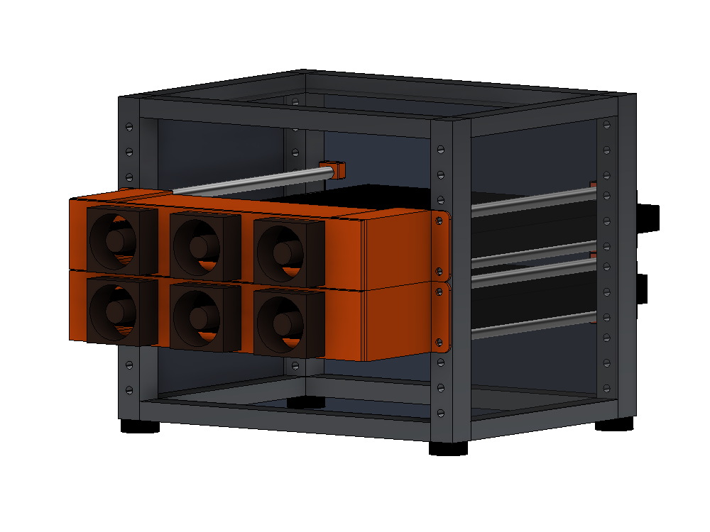

# Mini-Rack Laptop Trays

1U sliding laptop trays for 10-inch mini racks, with an actively cooled, ducted rear exhaust — designed for a MacBook Pro 14" and a Surface Laptop 13.8" living in a GeeekPi/DeskPi RackMate-style 4U cabinet.

Each laptop slides in and out like a drawer on four 8 mm smooth rods, held by 3D-printed ears on the front and rear rack rails. A printed fan plate with three 40 mm Noctua fans bolts onto the rear ears and pulls air across the top and bottom of the laptop, exhausting out the back — all within a single rack unit.

Every printed part in the bill of materials is in there, except the fan opening plug — that one only exists if you run two fans instead of three, and this shows three. Fasteners are not modelled.

Want to spin it yourself? **[Open the interactive 3D viewer](https://mhuot.github.io/mini-rack-laptop-trays/)** — full color, drag to orbit, scroll to zoom. GitHub also renders **[docs/rack-mockup.stl](docs/rack-mockup.stl)** with its built-in STL viewer. (Both are visual mockups, not print files — the printable STLs live in [`exports/`](exports/). Printed parts are shown in orange; print in whatever color you like.)

## How it works

| | |
|---|---|
|  |  |

- **Front and rear ears** print in mirrored pairs and bolt to the rack rails with standard rack screws. Each ear carries two 8 mm smooth-rod positions, spaced to leave a 24 mm gap — the laptop slides between the rod pairs and rests on the lower rods.
- **The rear ears extend 72 mm out the back of the rack**, so the laptop's rear edge sits behind the rear rail and stops against the ears' back plates **65 mm in**. The rod bores run that same 65 mm, so they are blind — the back plate is their floor. The 243 mm rods reach 41 mm in and leave 24 mm of bore empty; a 267 mm rod would bottom out on the plate and be positively located. A MacBook Pro 14 noses 47.6 mm out the front; the Surface Laptop 13.8, 36.0 mm. The 7 mm left between that stop and the fan plate is the duct exit — the gap the air turns through on its way into the fans.
- **The fan plate** screws into heat-set inserts in the rear ears' back plates. Three Noctua NF-A4x20 5V fans (40 mm fits upright inside the 44.45 mm rack unit) exhaust rearward, at x = 0 and ±63.55 — the centroids of three equal zones across the duct, so each draws its own third of it. Two 2.2 mm duct panels close the top and bottom of the rear overhang, and the rear ears carry a 2 mm outboard side wall closing their side windows — so the fans can only draw air from inside the rack, sweeping the lid and the underside of the chassis on the way through.
- **Fan wiring** runs along the rear face of the plate, held clear of the blades by zip ties through the slot pairs between the fan bodies. The outboard pair is strain relief where the bundle leaves for the USB supply. Splices belong outside the rack, near the power source, not pocketed into a 4 mm plate.
- Laptops run clamshell; all cables exit at the front (orient the Surface with its USB-C edge forward).
- The RackMate-style cabinet has closed acrylic sides and top, so the front opening is the only intake: the fans drive true front-to-back flow through the slot, and the hinge-side exhaust is entrained in the same rearward stream. No side baffles needed.

## Compatibility

Designed around a rack with 236.525 mm rail-hole span and 200 mm rail-to-rail depth ([GeeekPi 4U 10-inch cabinet / DeskPi RackMate T0](https://www.amazon.com/dp/B0DPGZPTPP); see the [mini-rack project](https://mini-rack.jeffgeerling.com/) for the ecosystem).

| Laptop | Dimensions (mm) | Fit |
|---|---|---|
| MacBook Pro 14 (M-series) | 312.6 × 221.2 × 15.5 | ✅ designed for |
| Surface Laptop 7th Ed. 13.8" (Intel) | 301 × 220 × 17.5 | ✅ same parts, unchanged |

Anything ≤ 222 mm deep and ≤ ~20 mm thick that can hang its side edges on rods 205.6 mm apart should work.

## Bill of materials (per tray)

**Printed parts** (PETG recommended — parts live next to a warm laptop):

| Part | Qty | Notes |
|---|---|---|
| Front Ear (`exports/front_ear.stl`) | 2 | mirror one in the slicer |
| Rear Ear v2 (`exports/rear_ear_v2.stl`) | 2 | mirror one; bosses take M3 heat-set inserts |
| Rear Fan Plate (`exports/rear_fan_plate.stl`) | 1 | flat 4 mm slab, ~45 min |
| Duct panel (`exports/duct_panel.stl`) | 2 | flat 2.2 mm sheets, 194.4 × 74; slide into the ears' duct rails |
| Fan opening plug (`exports/fan_plug.stl`) | 0–1 | only if starting with two fans — see below |

**Ready-made print plates**, arranged for a 250 × 220 bed and mirrored where needed. Regenerate with `scripts/build_print_plate.py`.

- `exports/print_plate_ears_heatset.3mf` (also `_selftap` / `_nuttrap`) — both rear ears, both front ears, two fan plugs. Print once.
- `exports/print_plate_ducted_fan_plate.3mf` — the one-piece alternative, if you want it instead of the plate-plus-panels.
- `exports/print_plate_duct_panels.3mf` and `exports/print_plate_fan_plate.3mf` — the duct set, split across two plates. This is what you reprint when you change the fan layout.

The duct is two plates rather than one because together the three parts fill the bed corner to corner, which put a panel corner 14 mm from the left edge and 8 mm from the front — and that corner is where first layers fail. Split, each plate centres with at least 20 mm clear on every side, brim included.

The ears also fit a Prusa Mini, so they can go on a second printer while the duct set runs: `exports/print_plate_ears_heatset_mini.3mf`. Neither duct plate can — the panels are 194 mm and the fan plate 222 mm, both past a 180 mm bed. Pass `--bed mini` to the generator for other variants.

The duct is modular on purpose. The two panels slide into duct rails on the rear ears and are trapped by the fan plate, so the duct stays with the rack when the plate comes off. Changing fan count or spacing means reprinting a flat slab in under an hour instead of a six-hour part that is mostly duct wall.

Those duct rails reach 10 mm inboard from each ear, into the dead space above and below the laptop, and carry a 2.4 mm slot between 2 mm walls. That holds a panel over 12 mm of its width rather than the 2 mm a pocket in the ear face managed on its own, and it does it without making the panel any bigger — the rails add material rather than hollowing the ear out, so the rod bores are untouched and the part still prints with no overhangs.

The duct rails only grip 10 mm at each end, though, which left 170 mm of free sheet whose rear edge had nothing holding it against the fan plate. So the plate carries a 2 mm-deep capture groove on each panel line and the panels run 74 mm — 72 of duct plus 2 into the groove. That laps the joint instead of butting it, and pulls the rear edge flat at the same time. Along the panel line each fan opening is only about 8.6 mm wide, so roughly 76% of the panel edge lands in solid groove and the rest opens into a fan opening, which is where the air is going anyway.

Panels are 2.2 mm rather than 2.0 for the same reason a loose hinge rattles: 2.0 in a 2.4 slot leaves 0.4 mm of free play, and a 37 g sheet with that much room next to the fans will buzz. 2.2 is eleven layers at 0.2 mm and halves the gap to a normal sliding fit.

`scripts/check_rear_assembly.py` fits the exported STLs together and checks both of these — every pair intersected exactly for interference, then a flood fill of the air in a cross-section to see whether the duct reaches ambient. It currently reports no interference, and a seal with each panel resting against either wall of its slot.

### Why three fans

Three is where the fan openings stop being the restriction. The duct's own free
area is about 3880 mm² with a MacBook in it and 3498 with the thicker Surface;
three Ø39 openings are 3584 mm². Two would be 2389 — throttling the duct to 62%
and leaving a 47.7 mm fan-free span across the middle of the laptop. Four was
4778, comfortably past the crossover, buying noise rather than air. Three also
draws 0.3 A, so a tray still runs off any USB port.

Positions are the centroids of three equal-width zones, so no part of the duct
is more than 31.8 mm from a fan — against 47.7 mm with two.

### The one-piece alternative

`exports/ducted_fan_plate.stl` is the fan plate with the duct walls grown onto
it: one part instead of three, and no joint to seal because there isn't one.
Its walls are 194.44 mm wide, the same as the separate panels, so they slide
into the same duct rails.

It costs you the thing the modular duct was built for. The fan count is fixed
in the geometry, and the walls print as two 2.2 mm fins standing 72 mm off the
plate, which is slower and more delicate than two flat sheets. Print it
plate-down so the first layer is the full solid rectangle.

No heat-set inserts on hand? Two alternatives, same fan plate and M3 × 8 screws either way:

- **Nut-trap** (`exports/rear_ear_v2_nuttrap.stl`) — a slightly taller rib with side-loading slots that capture standard **M3 hex nuts** (a DIN 562 square nut fits the same slot). Metal threads, unlimited assembly cycles, hardware you already have. The fan plate sits 2 mm further back (~98 mm total behind the rear rail).
- **Self-tap** (`exports/rear_ear_v2_selftap.stl`) — Ø2.5 pilot holes the M3 screws thread directly into the plastic. Simplest, but good for only about a dozen assembly cycles.

The insert version remains the most compact and the nicest to work on.

A note on all three, because it is not obvious from looking at them: the ear prints standing on its rail flange, so the back plate starts as a bridge across the open duct and the insert pocket sits directly above it. Whatever floor is left under a pocket is made of the first bridged layers, with nothing on top to pull them flat — get it too thin and the bottom of the pocket comes out rough. The heat-set pocket is 3.2 mm deep on a 3.8 mm floor; the self-tap and nut-trap variants keep 1.5 mm on a thinner plate.

**Hardware:**

| Item | Qty | Notes |
|---|---|---|
| 8 mm smooth rod, 243 mm | 4 | see [Smooth rods](#smooth-rods) |
| [Noctua NF-A4x20 5V](https://www.amazon.com/Noctua-NF-A4x20-5V-3-Pin-Premium/dp/B072Q3CMRW) | 2–3 | ships with OmniJoin + fan screws |
| [M3 × 3 mm heat-set inserts (short)](https://cnckitchenus.store/products/heat-set-insert-m3-x-3-short-version-100-pieces) | 4 | e.g. CNC Kitchen; Ø4.0 × 3.2 pockets (skip for the self-tap ear variant) |
| M3 × 8 socket-head screws | 4 | |
| M3 hex nuts | 4 | nut-trap ear variant only |
| Rack screws | 8 | per your rack's rail standard |
| Spare USB-A cable to sacrifice | 1 per tray | spliced with the included OmniJoin set — see [Wiring](#wiring-the-fans) |
| Noctua NA-SYC1 chromax Y-cables | optional | [set of three](https://www.amazon.com/Noctua-NA-SYC1-black-NA-SYC1-chromax-Black-y-Cables/dp/B076542HBN) tidies one tray's junction |

## Wiring the fans

The NF-A4x20 5V draws 0.1 A max ([0.5 W, spec](https://www.noctua.at/en/products/nf-a4x20-5v/specifications)), so a full tray of four is 0.4 A worst case — inside the 0.5 A budget of any USB 2.0 port. Both trays on one port is 0.8 A, which wants a USB 3 port (0.9 A) or a 5 V / 1 A phone charger.

The box gives you everything except the USB end: each fan ships with a 30 cm extension and Noctua's OmniJoin splice set (solderless 3M connectors). No USB adapter is included, and **avoid generic "USB fan adapter" cables — most contain a 5 V→12 V boost converter that will kill a 5 V fan.** A 5 V Noctua must never see 12 V.

Per tray:

1. Sacrifice any USB-A cable. Cut off the device end, strip the jacket, keep the **red (+5 V)** and **black (GND)** conductors, and insulate the data pair (green/white) out of the way.
2. Join all three fans' +5 V leads to USB red and all three GND leads to USB black with the OmniJoin connectors (identify the fan leads from the OmniJoin instruction leaflet — Noctua's cables are all-black, the leaflet is the pinout). Leave each fan's tach lead unconnected and insulated; nothing reads it.
3. Route the bundle along the top duct panel, down the inside of the rear post, and zip-tie it with a service loop generous enough that the fan plate can be unscrewed without unplugging anything.
4. Plug in and confirm all four spin before sliding the laptop in.

If you'd rather not splice three joints, two [NA-SYC1 Y-cables](https://www.amazon.com/Noctua-NA-SYC1-black-NA-SYC1-chromax-Black-y-Cables/dp/B076542HBN) merge the three fans to a single 3-pin lead first, leaving one splice to the USB cable. Passive wiring, fine at 5 V.

**Two fans or three?** Rough math says two fans per tray move enough air for typical clamshell loads (~14 °C air rise carrying 40 W); three is what the duct can actually swallow — see [Why three fans](#why-three-fans). The plate has three openings either way, and an empty opening would let the running fans pull backflow, so if you start with two, print a plug and press it into the unused opening from the rear (duct suction seats it tighter). Use the two outer positions and plug the centre. To upgrade later, drive an M3 screw two turns into the plug's center pilot, pull it, and add the third fan — no reprint. The print plates include two plugs.

## Smooth rods

Any 8 mm smooth rod works (hardened steel or stainless linear rod is ideal — it's what the renders show). The rods are just long enough to connect the front and rear ears — they do **not** extend past the front:

- **Cut all four rods to 243 mm** (the as-built length). That runs from flush with the front ear's face, through the 200 mm rack, and ~40 mm into the rear ears' bores — plenty of engagement without needing to bottom out against the rear back plates.
- The front ears straddle the front rail: only their thin 2 mm face plate (with the recessed screw heads) sits on the rail's front face, while the rod blocks pass through the rack opening behind it. The front of the rack stays essentially flush — nothing pokes forward but the laptops.
- The laptop's front overhang (MacBook Pro 14: ~45 mm, Surface 13.8: ~33 mm) is cantilevered past the front ears — the chassis is more than stiff enough for this.
- Deburr and lightly chamfer the ends so they slide into the printed bores without shaving them. The 8.0 mm fit is snug — no retention hardware needed, and the fan plate closes off the rear.

## Assembly

1. Print the parts; heat-set the four inserts into the rear ear bosses.
2. Mount front ears to the front rails, rear ears to the rear rails (rear ears point out the back of the rack).
3. Slide the four rods through the front ears into the rear ears' sockets.
4. Screw the fans to the rear face of the fan plate (labels facing back — they exhaust rearward), then drive the M3 screws through the plate's counterbored tabs into the ear inserts.
5. Wire the fans per [Wiring](#wiring-the-fans), confirm they spin, and slide the laptop in, lid closed, cables at the front.

Total stack behind the rear rail is ~96 mm (ears 69 + pads 3 + plate 4 + fans 20) — leave that much clearance behind the rack.

## CAD

Models are built in Fusion 360, driven by the Python scripts in [`scripts/`](scripts/) (run inside Fusion — e.g. via a Fusion MCP add-in, or paste into a Fusion script). Each script is parametric through the constants at the top and regenerates its part from scratch:

- [`build_rear_ear_v2.py`](scripts/build_rear_ear_v2.py) — copies the proven rear ear bodies and adds the insert bosses
- [`export_front_ear.py`](scripts/export_front_ear.py) — exports the front ear with a slicer-friendly tangency relief
- [`build_print_plate.py`](scripts/build_print_plate.py) — assembles the one-tray 3MF print plates from the STLs
- [`build_rear_fan_plate.py`](scripts/build_rear_fan_plate.py) — the fan plate, with the wiring tie slots
- [`build_duct_panel.py`](scripts/build_duct_panel.py) — the duct panels
- [`build_fan_plug.py`](scripts/build_fan_plug.py) — the blanking plug for unused fan openings
- [`build_rack_mockup.py`](scripts/build_rack_mockup.py) — the full-rack mockup used for the renders on this page
- [`add_duct_rails.py`](scripts/add_duct_rails.py) — adds the duct rails to the parametric rear ear
- [`fix_insert_pockets.py`](scripts/fix_insert_pockets.py) — cuts the heat-set pockets as one explicit feature

And three that run locally rather than inside Fusion:

- [`check_rear_assembly.py`](scripts/check_rear_assembly.py) — fits the rear parts together and checks for interference and air leaks
- [`whiten_renders.py`](scripts/whiten_renders.py) — flattens Fusion's viewport gradient to white in the exported renders
- [`check_terminology.py`](scripts/check_terminology.py) — every part has one name; this fails if a retired one creeps back in. Standard library only, so it just runs.

Fusion API note: all API lengths are centimeters; the scripts define `MM = 0.1` and work in millimeters throughout.

Every printable part also ships as standalone CAD in [`cad/`](cad/) — a STEP and a Fusion archive (`.f3d`) per part, current revision, importable into any CAD package. The original parametric ear and reference-body designs live in the Fusion archives (`*.f3d`) at the repo root.

## License

[MIT](LICENSE) — scripts, models, and STLs alike. Attribution appreciated but not required.
